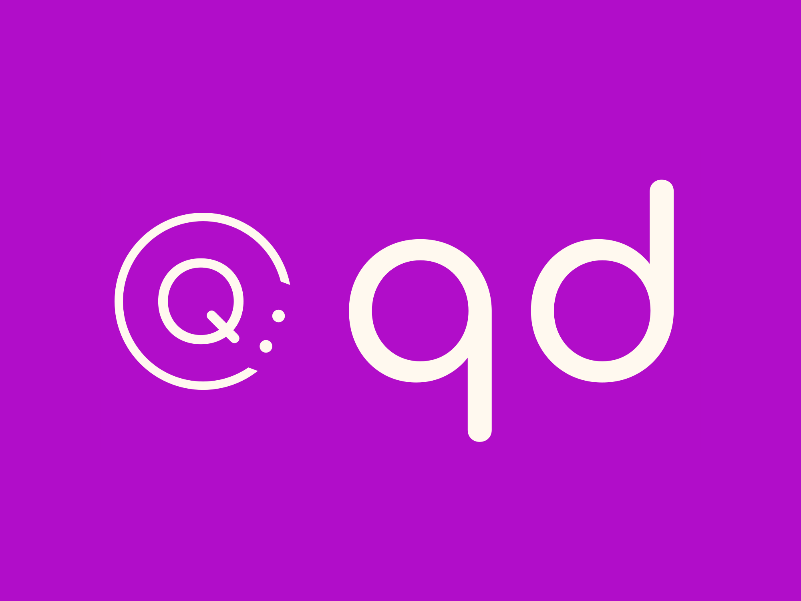

# Quick-Dev

<div align="center">
    
</div>

A docker-based development environment aimed at letting you quickly and easily spin-up dev environments for different project types.


## Requirements
`ruby 3.0.2+`

## Installation


Clone the git repo and enter the directory

```bash
  git clone https://github.com/cwarwicker/quick-dev/ dev
  cd dev
```

Run the bundle script to install all the required Ruby gems.

```bash
bundle install
```

Make a quick-dev config directory within your home directory.

```bash
mkdir ~/.config/quick-dev
```

Copy the config file across to the newly created config directory.

```bash
cp config ~/.config/quick-dev
```

Edit your **`~/.bashrc`** file and add the following line to the end:

```bash
source ~/.config/quick-dev/config
```

And reload your .bashrc file with `source`:

```bash
source ~/.bashrc
```

Confirm Quick-Dev is installed correctly and your alias is working by running:

```bash
qd version
```

You should see output like:

    Quick-Dev 1.0
    Made by Conn Warwicker
    For any issues or feature requests, see: https://github.com/cwarwicker/quick-dev)

## Adding a new project

Clone your project into its own directory within the `/apps` directory.

E.g.
```bash
git clone https://github.com/<user>/<project> apps/my_project
cd apps/my_project
```

Run the config command within your project.

```bash
qd config
```

(Note: There are some preset configurations which you can choose from instead of rolling your own. To select one of these add the `-p` or `--preset` flag. E.g. `qd config --preset`)

This will bring up a series of menus to choose the project type, image, etc... as well as any other services required, such as database, caching, etc...

### Project Type
Currently Quick-Dev supports the following project types:

- Laravel
- Moodle
- PHP (General)
- Other

You can still use Quick-Dev with any type of project you like, it's just that project-specific configuration and commands have been added for the supported list.

### Images
You can choose from the pre-built images for the supported project types (See: `.docker/images/` if you want to see what they contain). Or you can choose `custom` and just type in any docker image to pull.

### Other services

**Database**

Currently you can choose from the following pre-defined database engines:

- MariaDB
- MySQL
- PostgreSQL

And for each supported database engine, you can choose from any of their LTS versions.

Again, you can also choose `custom` and put in any docker image you want to pull for a different database engine, however, just remember that if you choose something different, but used a pre-built application image, it may not have the correct drivers/extensions, so you might need to do a custom application image as well.

**Caching**

Currently you can choose from the following pre-defined caching engines:

- Redis

And for each supported database engine, you can choose from any of their LTS versions.

Again, you can also choose `custom` and put in any docker image you want to pull for a different caching engine.


Once you have finished with the config, you should find a `cfg.yaml` file in your project directory.

Next, you can simply start the project by running:

```bash
qd up
```

This will create the `docker-compose.yml` file based on your config info, and bring up all the containers.
## Commands

`qd help` - Displays the help information

`qd version` - Displays the verison of Quick-Dev you are running.

`qd config` - Runs the project configuration wizard

`qd up [-r|--rebuild]` - Starts the project containers (and core Quick-Dev containers). The `-r` or `--rebuild` flag will force a re-build instead of using the cached images.

`qd stop [-a|--all]` - Stops the project containers. The `-a` or `--all` flag will also stop the core Quick-Dev containers.

`qd destroy [-a|--all]` - Stops and deletes the project containers. The `-a` or `--all` flag will also stop and delete the core Quick-Dev containers.

`qd remove` - Stops and deletes the project containers, removes any project-specific files elsewhere, and finally deletes the whole project directory.

`qd connect [container]` - Connects to a docker container and runs a `bash` terminal. By default this will be your main application container. The `container` argument lets you specify any container name to try and connect to.

`qd services [-a|--all]` - Lists all your project services, their statuses and any URLs. The `-a` or `--all` flag also lists the core Quick-Dev services.

`qd cmd [command]` - Runs any specified command on the application container. The `command` flag contains the command you want to run. For example `qd cmd echo 'Hello'` will connec to the application container and run the command `echo 'Hello'`. So this can be used to run essentially anything you want to on the application container.

### Project-Specific Commands

These are pre-defined commands you can run without having to prefix with `cmd`.

**Laravel**

`qd artisan [command]` - Run the specified artisan command on the application container.

**Moodle**

`qd install` - Runs the Moodle installation script, using pre-defined defaults.

`qd upgrade` - Runs the database upgrade script.

`qd purge` - Runs the purge caches script.

**All**

`qd composer [command]` - Run the specified composer command on the application container.


## Roadmap

- Add pre-set project configurations

- Add support for more project types

