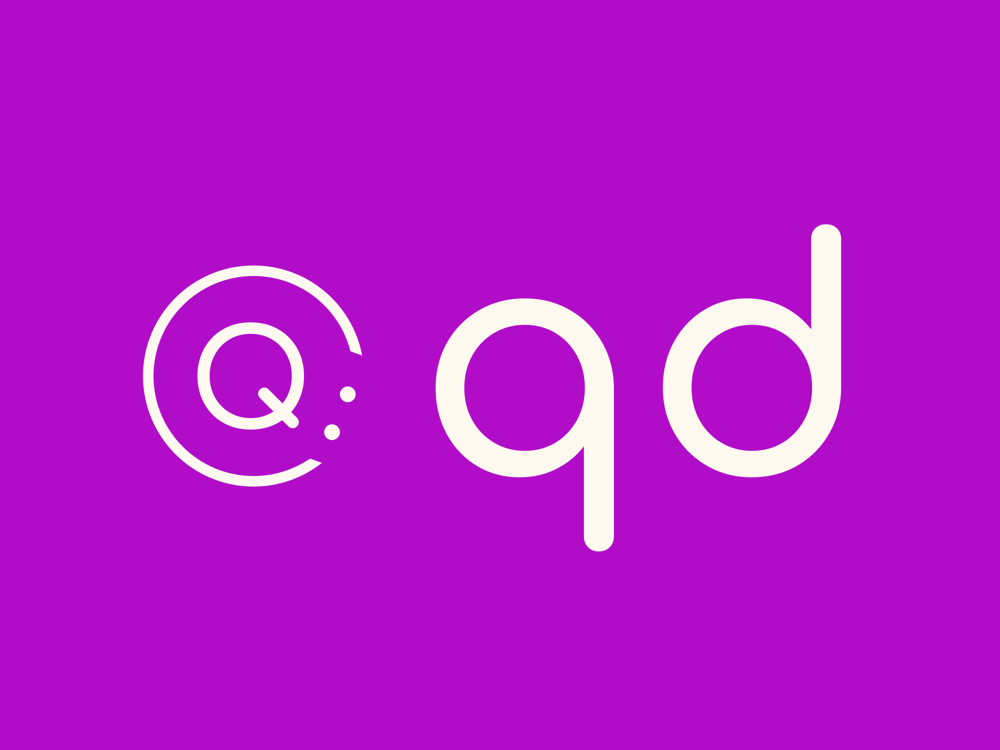
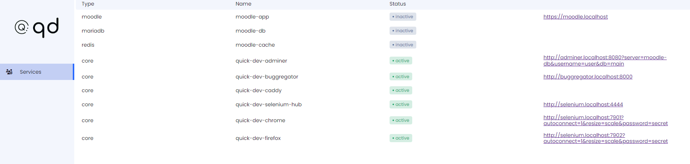

<div align="center">

[](https://forthebadge.com)

[![Contributors][contributors-shield]][contributors-url]
[![Forks][forks-shield]][forks-url]
[![Stargazers][stars-shield]][stars-url]

[![Issues][issues-shield]][issues-url]
[![ClosedIssues][closed-issues-shield]][closed-issues-url]
[![PR][open-shield]][open-url]
[![ClosedPR][closed-shield]][closed-url]
</div>

# Quick-Dev

<div align="center">
    
</div>

A docker-based development environment aimed at letting you quickly and easily spin-up dev environments for different project types, with minimal fuss and learning curve.

<div align="center">
    
</div>

## Table of Contents

* [Requirements](#requirements)
* [Installation](#installation)
* [Adding a new project](#adding-a-new-project)
* [Roadmap](#roadmap)
* [FAQ](#faq)


## Requirements
- `linux` - Quick-Dev is not supported on windows or mac
- `ruby 3.0.2+` - `sudo apt install ruby-full`

## Installation

Clone the git repo and enter the directory

```bash
  git clone https://github.com/cwarwicker/quick-dev/ dev
  cd dev
```

Run the bundle script to install all the required Ruby gems.

```bash
bundle install
```

Make a quick-dev config directory within your home directory.

```bash
mkdir ~/.config/quick-dev
```

Copy the config file across to the newly created config directory.

```bash
cp config ~/.config/quick-dev
```

Edit your **`~/.bashrc`** file and add the following line to the end:

```bash
source ~/.config/quick-dev/config
```

And reload your .bashrc file with `source`:

```bash
source ~/.bashrc
```

Confirm Quick-Dev is installed correctly and your alias is working by running:

```bash
qd version
```

You should see output like:

    Quick-Dev 1.0

## Adding a new project

Clone your project into its own directory within the `/apps` directory.

E.g.
```bash
git clone https://github.com/<user>/<project> apps/my_project
cd apps/my_project
```

Run the config command within your project.

```bash
qd config
```

(Note: There are some preset configurations which you can choose from instead of rolling your own. To select one of these add the `-p` or `--preset` flag. E.g. `qd config --preset`)

This will bring up a series of menus to choose the project type, image, etc... as well as any other services required, such as database, caching, etc...

### Project Type
Currently Quick-Dev supports the following project types:

- PHP (General)
- Laravel
- Moodle
- Totara
- Python
- Django
- Other

You can still use Quick-Dev with any type of project you like, it's just that project-specific configuration and commands have been added for the supported list. If your project type is not in the list, just choose `Other` and custom build it.

### Images
You can choose from the pre-built images for the supported project types (See: `.docker/images/` if you want to see what they contain). Or you can choose `custom` and just type in any docker image to pull.

### Other services

**Database**

Currently you can choose from the following pre-defined database engines:

- MariaDB
- MySQL
- PostgreSQL

And for each supported database engine, you can choose from any of their LTS versions.

Again, you can also choose `custom` and put in any docker image you want to pull for a different database engine, however, just remember that if you choose something different, but used a pre-built application image, it may not have the correct drivers/extensions, so you might need to do a custom application image as well.

**Caching**

Currently you can choose from the following pre-defined caching engines:

- Redis

And for each supported database engine, you can choose from any of their LTS versions.

Again, you can also choose `custom` and put in any docker image you want to pull for a different caching engine.

### Hooks

You also have the option of adding hooks to any of the services in your project. These are scripts which are called at certain stages of the application lifecycle. Some pre-configured project types come with default hooks, but you can override them if you want to. Simply enter the path to the script to be run at the required stage.

**Available hooks**
- `pre-up` - This is a script run on the HOST machine, before the container is started (using `qd up`)
- `post-up` - This is a script run on the CONTAINER, after the container is started (using `qd up`)
- `pre-stop` - This is a script run on the CONTAINER, just before the container is stopped (using `qd stop`)
- `post-stop` - This is a script run on the HOST, just after the container is stopped (using `qd stop`)

**Example**
A good example of this is the default hook in the `moodle` project type, attached to the `application` container:

- `post_up: bash /mnt/post_up.sh`

This means that after the application container starts, the script mounted on the container at `/mnt/post_up.sh` is run on that container, which configures some bits for behat testing to work.

### Running the project

Once you have finished with the config, you should find a `cfg.yaml` file in your project directory.

Now, you can start the project by running:

```bash
qd up
```

This will create the `docker-compose.yml` file based on your config info, and bring up all the containers, and run any hooks.


## Commands

Run the `qd help` command to see a list of all available commands.


### Project-Specific Commands

These are pre-defined commands which are specific to certain project types. Project types inherit from parents, so for example, any commands specific to `php` projects, can also be used by php-related projects, such as `laravel` or `moodle`.

**PHP**

`qd install_debug` - Install debugging services to be used by Buggregator service.

**Laravel**

`qd artisan [command]` - Run the specified artisan command on the application container.

**Moodle**

`qd install` - Runs the Moodle installation script, using pre-defined defaults.

`qd upgrade` - Runs the database upgrade script.

`qd purge` - Runs the purge caches script.

`qd makecourse [size [name]` - Runs the make test course script and makes a course of the given size and name.

`qd phpunit init` - Initialises phpunit for the site (must be run before any phpunit commands).

`qd phpunit [command]` - Runs the specified phpunit tests

`qd behat init` - Initialises behat for the site (must be run before any behat commands).

`qd behat [command]` - Runs the specified behat tests (Default profile: chrome)

**Python**

`qd python [command]` - Runs the specified python command on the application container.

**Django**

`qd dj [command]` - Runs the specifiec django-admin command on the application container.

`qd runserver` - Starts the django server (manage.py) on port :8000.


**All**

`qd composer [command]` - Run the specified composer command on the application container.

`qd npm [command]` - Run the specified npm command on the application container.


## Roadmap

- Add support for more project types


## FAQ

- **Why did a git patch fail to apply when I created a `moodle` project?**

    Moodle prior to 5.0 doesn't support the web server Quick-Dev uses (Caddy), so we have to apply a patch to the setuplib.php to let it work. If this fails or conflicts, you'll need to double check your setuplib.php to make sure it's got the patch in it.
    See: `.docker/templates/moodle/01_caddy.patch`

- **I created a Moodle or Totara project but it errors on "Caddy is not available"**

    When you create a Moodle/Totara project via a preset configuration, a patch should be applied automatically (see above) to fix the problem of the codebase not allowing certain web servers. If you craete the project manually, you'll need to apply that patch manually as well, e.g. `git apply ./docker/templates/moodle/01_caddy.patch` or `git apply ./docker/templates/totara/01_caddy.patch`

    NOTE: In Moodle 5.0 and above this is not necessary.


[contributors-shield]: https://img.shields.io/github/contributors/cwarwicker/quick-dev.svg?style=flat-square
[contributors-url]: https://github.com/cwarwicker/quick-dev/graphs/contributors
[forks-shield]: https://img.shields.io/github/forks/cwarwicker/quick-dev.svg?style=flat-square
[forks-url]: https://github.com/cwarwicker/quick-dev/network/members
[stars-shield]: https://img.shields.io/github/stars/cwarwicker/quick-dev.svg?style=flat-square&color=brightgreen
[stars-url]: https://github.com/cwarwicker/quick-dev/stargazers
[issues-shield]: https://img.shields.io/github/issues/cwarwicker/quick-dev.svg?color=orange&style=flat-square&label=open%20issues
[issues-url]: https://github.com/cwarwicker/quick-dev/issues
[closed-shield]: https://img.shields.io/github/issues-pr-closed-raw/cwarwicker/quick-dev?color=purple&style=flat-square
[closed-url]: https://github.com/cwarwicker/quick-dev/pulls?q=is%3Apr+is%3Aclosed
[closed-issues-shield]: https://img.shields.io/github/issues-closed-raw/cwarwicker/quick-dev?color=purple&style=flat-square
[closed-issues-url]: https://github.com/cwarwicker/quick-dev/issues?q=is%3Aissue+is%3Aclosed
[open-shield]: https://img.shields.io/github/issues-pr/cwarwicker/quick-dev?color=orange&style=flat-square
[open-url]: https://github.com/cwarwicker/quick-dev/pulls
